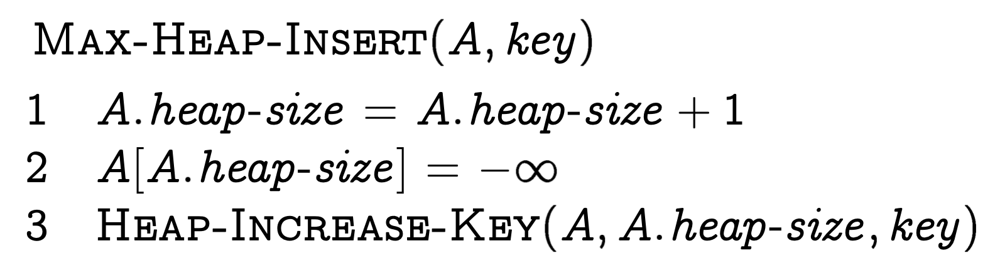

Attività laboratoriale: implementazione di una priority queue mediante MinHeap
===

Consegna
---

Warning: Svolgi le parti dell'esercitazione in maniera sequenziale!

### Parte #01

Scrivi un programma in C# che implementi, tramite la scrittura di una classe, la struttura dati MinHeap che memorizza un numero variabile \\(n \in \mathbb{N} \\) di chiavi \\( k \in \mathbb{N}\\), con tutte le operazioni previste per tale struttura dati. 

Hint: Puoi riguardare gli pseudocodici delle operazioni previste per **MaxHeap** dalle dispense condivise (o dagli allegati della consegna) e cercare di capire la logica da seguire per **MinHeap**.

#### Funzione di utilità di stampa
 
```csharp
public override string ToString()
{
	if (_keys == null || _keys.Count == 0)
	{
		return "Empty Heap";
	}
	
	var output = new StringBuilder();
	BuildTreeString(0, "", true, output);
	return output.ToString().TrimEnd();
}

private void BuildTreeString(int nodeIndex, string indent, bool isLast, StringBuilder output)
{
	if (nodeIndex >= Size) return;
	
	output.Append(indent);
	output.Append(isLast ? "└── " : "├── ");
	output.AppendLine(_keys[nodeIndex].ToString());
	indent += isLast ? " " : "│ ";

	int left = Left(nodeIndex);
	int right = Right(nodeIndex);

	if (left < Size)
	{
		BuildTreeString(left, indent, right >= Size, output);
	}
	if (right < Size)
	{
		BuildTreeString(right, indent, true, output);
	}
}
```

#### Possibile struttura iniziale (parziale)

```csharp
class MinHeap 
{
	private List<int> _keys;
	public int Size => _keys.Count;
	/* opzionale — può essere implementato diversamente (tramite funzioni spiegate in pseudocodice)
	// public int Minimum [...]
	*/
	
	public int Parent(int i) /* [...] */
	public int Left(int i) /* [...] */
	public int Right(int i) /* [...] */
	
	/* [...] */
}
```

---
### Parte #02

Abbiamo visto che possiamo realizzare una priority queue mediante Heap, raggiungendo un compromesso (in termini di complessità computazionale) tra una sua realizzazione basata su **vettore ordinato** e una su **vettore disordinato**. Realizza, in C#, una classe "`MinPriorityQueue`" in cui deve essere possibile:

1. Accodare un elemento (`Enqueue()`)
2. Servire l'elemento con priorità minore (`Dequeue()`)
3. Sapere quanti elementi sono in coda (`ElementsLeft`)

```csharp
public class MinPriorityQueue
{
    // [...]
    public int ElementsLeft => // ...

    public void Enqueue(int key) 
    {
        // ...
    }

    public int Dequeue() 
    {
        // ...
    }
    // [...]
}

```

Allegati
---

- [Web Slides](https://didattica-nm.github.io/heap-dsa/#/)

Note: Ricorda che in pseudocodice gli array iniziano da 1!


