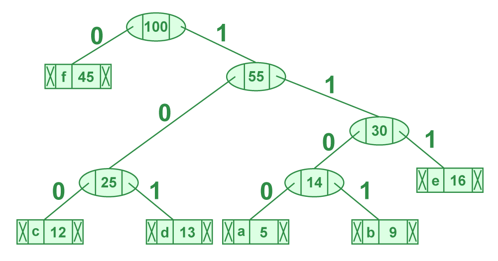

Attività laboratoriale: calcolare i codici di Huffman
===

Consegna
---

Dato un **albero di Huffman** [\[vai alla consegna\]](build-huffman-tree.md), calcolare i codici binari corrispondenti di ciascun carattere memorizzato nelle foglie dell'albero.

Codici di Huffman: come si calcolano
---

Il calcolo dei codici di Huffman è in realtà molto semplice e si appoggia su funzionalità di un albero molto standard: partendo dalla radice, dobbiamo attraversare ciascun livello dell'albero per raggiungere tutte le foglie (che, nel nostro caso, contengono i caratteri del testo che vogliamo codificare). Nel viaggio tra la radice e le foglie, teniamo una variabile "accumulatore" che memorizza:
- \\(0\\) per ogni volta che, preso un nodo, abbiamo attraversato il suo **figlio sinistro**;
- \\(1\\) per ogni volta che, preso un nodo, abbiamo attraversato il suo **figlio destro**.

Una volta arrivati alla foglia desiderata, il codice del carattere corrispondente si trova leggendo il valore della variabile "accumulatore".

Hint: nell'albero soprastante, il codice binario di '**c**' è **100**; oppure quello di '**e**' corrisponde a **111** ecc...

Warning: quale strategia di visita dell'albero dovremo adottare tra `pre-order`, `in-order` o `post-order`?